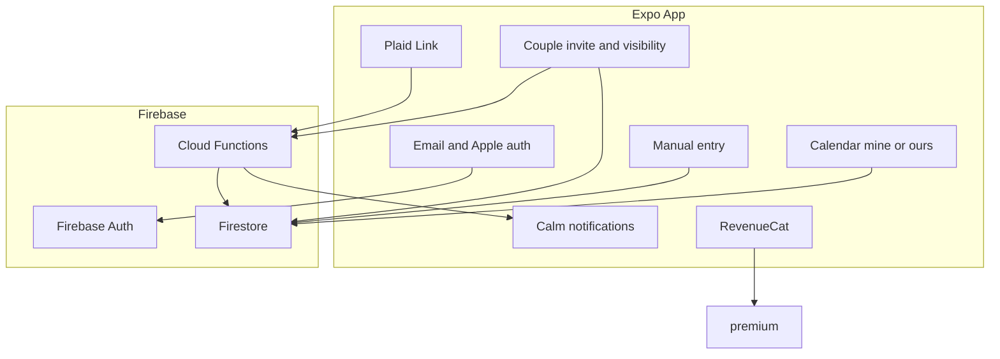

# Calm Money — Plan B MVP

## Defaults locked in

- **Firebase:** create `calm-money` (or `calm-money-<suffix>` if taken).
- **Auth:** email/password and Sign in with Apple.
- **Bank sync:** Plaid multi-country; secrets on Cloud Functions; provider-agnostic `bankConnections`.
- **International:** ISO currencies, locale formatting, i18n (`en` first), household `countryCode` + `defaultCurrency`.
- **Couple sharing:** first-class UI — invite partner, join household, **opt-in** visibility. Default view is still *your* spending (constitution §2). Pro-gated.
- **Notifications:** calm only — sync done, optional weekly digest, invite accepted. Never spend shame.
- **RevenueCat:** `premium` gates bank sync, couple sharing, longer history.
- **Styling:** Uniwind — off-white, muted sage, no alarm red.
- **Categorization (light):** provider category map + keyword heuristics + **merchant memory** (remember overrides) + one-tap correction. No trained ML model.

## Light categorization (in scope)

Resolution order when assigning a category (sync or manual suggest):

1. **Merchant memory** — normalized merchant key → last category this user (or household, if shared preference) chose.
2. **Keyword / name heuristics** — small static map (e.g. `UBER` → Transport, `NETFLIX` → Subscriptions).
3. **Provider map** — Plaid personal finance category → household category.
4. **Fallback** — “Other” (never block the txn).

On one-tap override: update the transaction **and** upsert `merchantRules/{ruleId}` so the next sync/add for that merchant sticks. Rules are per-user by default (partner doesn’t inherit your “Costco = Home” unless we later add optional household rules — v1 stays per-user for privacy).

## Stack

- **App:** Expo + Expo Router + `expo-dev-client`
- **UI:** Uniwind (Tailwind 4)
- **i18n:** `expo-localization` + `i18next` (en base)
- **Auth:** Firebase — email + Apple (`expo-apple-authentication`)
- **Backend:** Firestore + Cloud Functions
- **Bank:** `react-native-plaid-link-sdk` + Plaid API
- **Push:** `expo-notifications`
- **Monetization:** `react-native-purchases`

## Architecture



### Firestore data model

```
users/{uid}
  email, displayName, createdAt, householdId?
  locale, expoPushToken?
  notificationPrefs: { syncComplete, weeklyDigest, partnerInvite }

households/{hid}
  memberIds[]          // 1–2 for couples v1
  createdAt
  countryCode, defaultCurrency
  inviteCode?, inviteExpiresAt?

householdInvites/{inviteId}
  householdId, createdBy, emailOrCode
  status: pending | accepted | revoked
  createdAt, expiresAt

sharingPrefs/{uid_in_hid}   // per member, explicit opt-in
  householdId, userId
  shareTransactions: false   // default OFF — partner does not see yours until you turn on
  shareAccountIds[]          // optional subset when shareTransactions true
  displayNameInHousehold?

transactions/{tid}
  householdId, createdBy
  amountMinor, currency, date, merchant, categoryId
  note?, source: "manual" | "bank"
  provider?, externalTxnId?, externalAccountId?, pending?
  visibility: "private" | "household"   // derived/enforced from creator prefs at write/sync
  createdAt, updatedAt

categories/{cid}
  householdId, nameKey or name, color, icon

merchantRules/{ruleId}       // light “ML” — memory, not a model
  userId, householdId?
  merchantKey                // normalized: uppercased, strip store #s / noise
  categoryId
  source: "user_override" | "heuristic"
  updatedAt

bankConnections/{connectionId}
  householdId, userId, provider: "plaid"
  accessTokenEncrypted, institutionName, countryCode
  cursor?, status, lastSyncedAt, accountIds[]

bankAccounts/{accountId}
  householdId, connectionId, provider, ownerUserId
  name, mask, type, subtype, currency, isHidden?
```

**Privacy rules (constitution):** partner never sees your txns until `shareTransactions` is on. Calendar “Mine” = your `createdBy` / your accounts. “Ours” = union of what each member has opted to share + your own. Rules enforce read access accordingly.

### Free vs Pro

- **Free:** solo calendar + manual entry + current-year history; notification prefs.
- **Pro:** bank connect, **couple sharing**, longer history.
- Core insight (seeing *your* money) stays free.

### Notifications (constitution-safe)

Allowed: bank sync finished; optional weekly digest; “Partner joined” / invite accepted (quiet).

Forbidden: overspend alarms, shame, comparing partners’ spending judgmentally.

## Implementation steps

### 1. Scaffold Expo + Uniwind + i18n

- Expo Router in repo root; Uniwind theme; `expo-dev-client`; `i18n/en`; locale money/dates; household country/currency from device.

### 2. Firebase project

- Email + Apple auth; Firestore + Functions; rules for household membership, private vs shared txn reads, bank token secrecy.

### 3. Auth + shell

- Email + Continue with Apple; bootstrap solo household.
- Tabs: Calendar, Add, Settings (Sharing, Bank, Notifications, Region, Pro).

### 4. Calendar + manual entry

- Soft sage intensity; multi-currency as planned.
- **Mine / Ours** segmented control on calendar (Ours only useful with a partner + shared data).
- Fast add; one-tap category override.

### 5. Couple sharing UI

- Settings → Sharing: explain defaults (“Only you see your spending until you choose to share”).
- **Invite:** generate short code or email invite (Function creates `householdInvites`); partner enters code / opens link → joins `memberIds` (max 2 in v1) or merges into inviter household carefully (solo household vacated).
- **Accept / leave / revoke** invite screens — plain language, no jargon.
- **Opt-in toggles:** “Share my transactions with [partner]” (off by default); optional per-account share later if time.
- Partner display name; empty states when partner hasn’t shared yet (“Waiting on them — that’s okay”).
- Pro gate before creating/accepting a couple household link.

### 6. International bank sync (Plaid)

- As before; bank accounts tagged `ownerUserId` so Mine/Ours filtering works with sync.
- On ingest, run light categorization pipeline (memory → heuristics → provider → Other).

### 7. Light categorization

- Shared `categorizeTransaction()` used by Functions (bank sync) and client (manual suggest).
- Normalize merchant strings (strip `STORE #1234`, punctuation, collapse whitespace).
- One-tap category change writes `merchantRules` and updates the txn immediately.
- Seed a short heuristic list for common international merchants (ride-hail, groceries, streaming) — editable later, not a model.

### 8. Calm notifications

- Push token + prefs; sync complete; weekly digest; partner-joined.
- No spend-shame templates in codebase.

### 9. RevenueCat

- Gate bank sync, couple sharing, multi-year history.

### 10. Docs

- `.env.example` + README (Apple, Plaid, sharing privacy model → CONSTITUTION).

## Out of scope for this MVP

- Google Sign-In
- FX conversion / live exchange rates for calendar totals
- TrueLayer live adapter (schema ready)
- **Full / medium category ML** (trained classifiers, embeddings, continuous retraining)
- Anxiety/spend-alert notification types
- Households larger than 2 / family sharing

## Verify before calling done

- Email + Apple bootstrap; calendar Mine works solo.
- Invite → accept → both in household; partner sees nothing of yours until you opt in; Ours populates after share.
- Bank sandbox sync; calm pushes only.
- Override a synced merchant once → next import of that merchant keeps the new category.
- Pro gates sharing + bank; tokens never on client.
